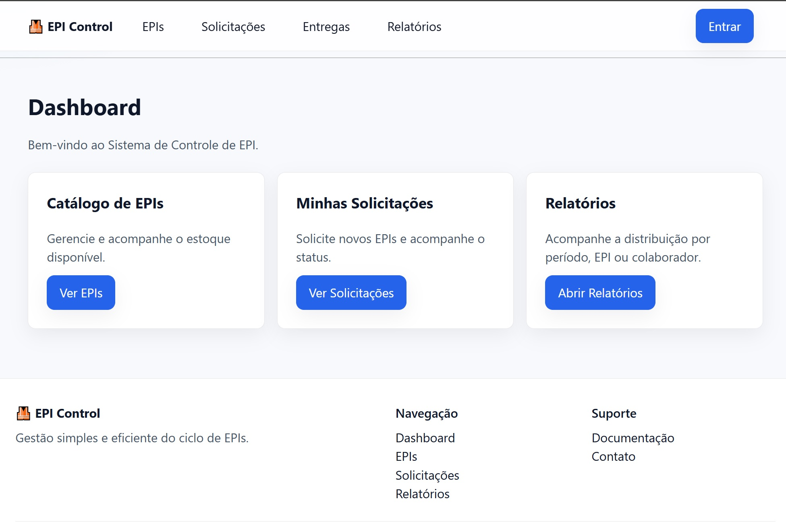
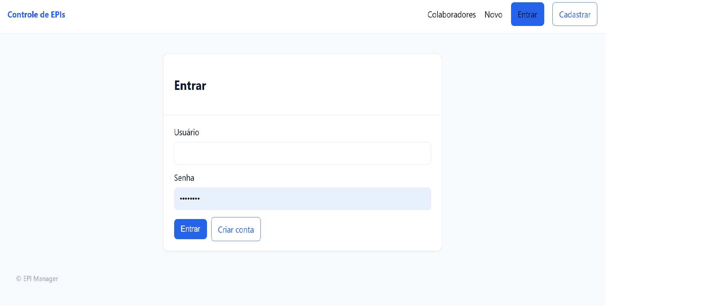
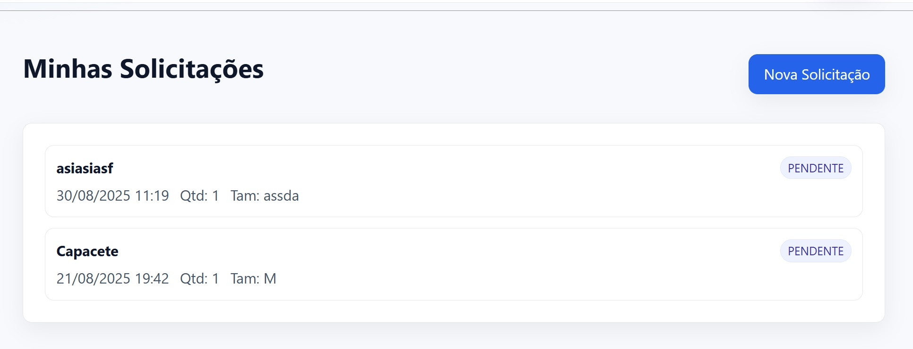

# Sistema de Controle de EPI

Sistema web desenvolvido em Django + Python para gerenciar o ciclo de vida dos EPIs (Equipamentos de Proteção Individual) por meio de solicitações, empréstimos (entregas) e recebimentos (devoluções), garantindo rastreabilidade, conformidade e controle de estoque.

---

## Indice

- [Visão Geral](#visão-geral)
- [Perfis de Usuário](#perfis-de-usuário)
- [Funcionalidades Principais](#funcionalidades-principais)
- [Fluxo de Funcionamento](#fluxo-de-funcionamento)
- [Modelos de Dados](#modelos-de-dados)
- [Telas Mínimas](#telas-mínimas)
- [Diagramas](#diagramas)
- [Requisitos](#requisitos)
  - [Requisitos Funcionais (RF)](#requisitos-funcionais-rf)
  - [Requisitos Não Funcionais (RNF)](#requisitos-não-funcionais-rnf)
  - [Regras de Negócio (RN)](#regras-de-negócio-rn)
- [Instalação e Execução](#instalação-e-execução)
- [Estilos e UI](#estilos-e-ui)


---

## Visão Geral

O sistema permite:

- Solicitação de empréstimos de EPIs por colaboradores.
- Cadastro e manutenção de tipos de EPIs e estoque pelos almoxarifes.
- Registro de empréstimos (entregas) e recebimentos (devoluções).
- Relatórios de empréstimos por colaborador, por EPI e por período.
- Atualização automática do estoque após cada movimentação (entrega/recebimento).

[🔝 Voltar ao Índice](#indice)

---

## Perfis de Usuário

- Administrador

  - Gerencia usuários e acessos.
  - Acompanha relatórios globais.

- Almoxarife

  - Cadastra tipos de EPIs e gerencia estoque.
  - Atende solicitações de empréstimo (entrega).
  - Registra recebimentos (devoluções) de EPIs.

- Colaborador
  - Solicita empréstimos de EPIs necessários.
  - Consulta histórico e status das solicitações e empréstimos.

[🔝 Voltar ao Índice](#indice)

---

## Funcionalidades Principais

### Cadastro de EPIs (Almoxarife)

- Criar e editar tipos de EPIs.
- Informações: nome, categoria, tamanhos, validade, vida útil, foto.
- Controle de estoque disponível.

### Solicitação de Empréstimos (Colaborador)

- Solicitar EPI e quantidade via painel.
- Acompanhar status: pendente, atendida, recusada (opcional).

### Empréstimos e Recebimentos (Almoxarife)

- Visualizar solicitações pendentes e atender com entrega.
- Registrar recebimento (devolução) de EPIs emprestados.
- Estoque atualizado automaticamente a cada operação.

### Relatórios

- Por colaborador: empréstimos ativos e histórico.
- Por EPI: quantidades emprestadas e devolvidas; saldo em estoque.
- Por período: total de empréstimos/recebimentos no intervalo.

[🔝 Voltar ao Índice](#indice)

---

## Fluxo de Funcionamento

1. Colaborador solicita o empréstimo de um EPI.
2. Almoxarife atende a solicitação e realiza a entrega (empréstimo).
3. Após uso, o colaborador devolve o EPI e o almoxarife registra o recebimento.
4. O sistema atualiza o estoque e mantém o histórico para relatórios.

[🔝 Voltar ao Índice](#indice)

---

## Modelos de Dados

- TipoEPI

  - Nome, categoria, tamanho, validade, vida útil, foto, quantidade_estoque.

- SolicitacaoEmprestimo

  - Colaborador, EPI, quantidade, data_solicitacao, status (pendente/atendida/recusada).

- EmprestimoEPI
  - Solicitação vinculada, almoxarife responsável, data_entrega, quantidade, data_prevista_devolucao (opcional), data_recebimento (quando devolvido), status (ativo/devolvido).

Observações:

- Estoque decrementa na entrega e incrementa no recebimento.
- Regras impedem estoque negativo.

[🔝 Voltar ao Índice](#indice)

---

## Telas Mínimas

- Home/Inicio/Dashboard

- Login/Logout (autenticação Django).


- Dashboard por perfil:
  - Colaborador: criar solicitações, acompanhar status, histórico.
  - Almoxarife: cadastro de EPIs, solicitações pendentes, empréstimos ativos, registrar recebimentos, estoque.
  - Administrador: relatórios e gestão de usuários.

- Relatórios: filtros por colaborador, EPI ou período.

[🔝 Voltar ao Índice](#indice)

---

## Diagramas

### Caso de Uso


### Entidades e Relacionamento


[🔝 Voltar ao Índice](#indice)

---

## Requisitos

### Requisitos Funcionais (RF)

1. O sistema deve permitir que colaboradores solicitem empréstimos de EPIs.
2. O sistema deve permitir que almoxarifes cadastrem tipos de EPIs.
3. O sistema deve permitir que almoxarifes registrem a entrega e recebimento de EPIs emprestados.
4. O sistema deve gerar relatórios de empréstimos por colaborador, por EPI e por período.
5. O sistema deve atualizar automaticamente o estoque após cada entrega.

### Requisitos Não Funcionais (RNF)

1. O sistema deve ser desenvolvido em Django + Python.
2. O banco de dados deve ser relacional (SQLite ou MySQL).
3. O sistema deve possuir autenticação baseada em usuários do Django.
4. O sistema deve possuir interface web responsiva e simples.

### Regras de Negócio (RN)

1. Cada empréstimo de EPI deve estar vinculado a uma solicitação feita por um colaborador.
2. O estoque não pode ser negativo após uma entrega.
3. Apenas almoxarifes podem registrar entregas de EPIs.
4. Apenas administradores podem cadastrar e gerenciar usuários.
5. Um colaborador só pode solicitar EPIs previamente cadastrados no sistema.

[🔝 Voltar ao Índice](#indice)

---

## Instalação e Execução

### Pré-requisitos

- Python **3.10+**
- Pipenv ou Virtualenv (opcional)
- Git

### Passo a passo

```bash
# Clonar o repositório
git clone https://github.com/seu-usuario/sistema-controle-epi.git
cd sistema-controle-epi

# Criar e ativar ambiente virtual (opcional, mas recomendado)
python -m venv venv
source venv/bin/activate   # Linux/Mac
venv\Scripts\activate      # Windows

# Instalar dependências
pip install -r requirements.txt

# Criar e aplicar migrações
python manage.py makemigrations
python manage.py migrate

# Criar superusuário (admin)
python manage.py createsuperuser

# Rodar o servidor
python manage.py runserver
```

### A aplicação estará disponível em:

👉 [http://localhost:8000](http://localhost:8000)

[🔝 Voltar ao Índice](#indice)

---

## Estilos e UI
O frontend utiliza uma estilização moderna e clean com CSS dividido por responsabilidade:

- static/css/reset.css, variables.css, base.css, layout.css, components.css
- static/css/pages/ (estilos específicos por página como dashboard.css, forms.css, tables.css)

Os templates foram atualizados para usar classes semânticas (card, grid, table, form-grid, btn).  
A navbar é responsiva e possui um toggle simples implementado em static/js/app.js.

Para ajustes de tema (cores, espaçamentos), altere static/css/variables.css.

[🔝 Voltar ao Índice](#indice)
